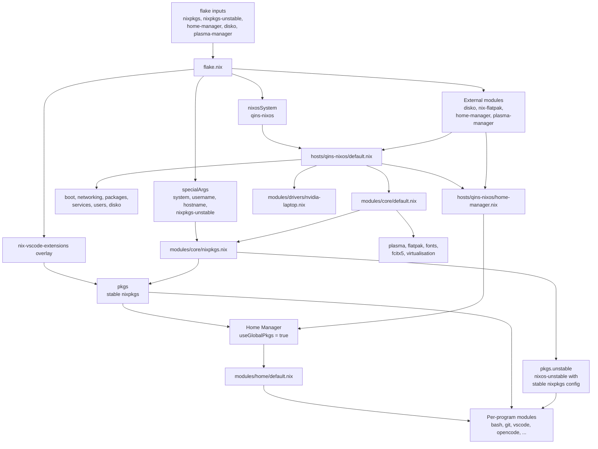

# NixOS Configuration

This repository contains the NixOS and Home Manager configuration for `qins-nixos`.

Packages normally come from stable `nixpkgs`. Packages from `nixos-unstable` are available as `pkgs.unstable`:

```nix
environment.systemPackages = [ pkgs.unstable.some-package ];
```

The unstable package set uses the same `allowUnfree` setting as stable packages. This is configured in `modules/core/nixpkgs.nix`.

Home Manager modules are in `modules/home/`, with one file per program where practical.

## Configuration Flow


