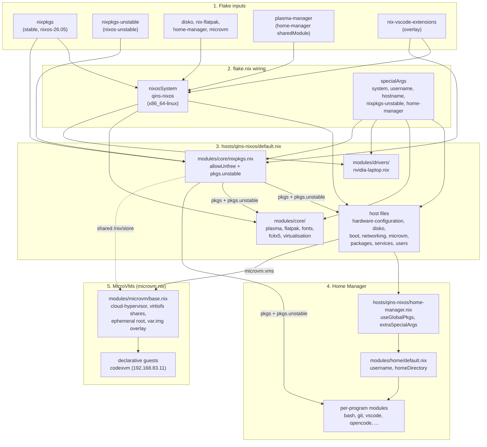

# NixOS Configuration

This repository contains the NixOS and Home Manager configuration for `qins-nixos`.

Packages normally come from stable `nixpkgs`. Packages from `nixos-unstable` are available as `pkgs.unstable`:

```nix
environment.systemPackages = [ pkgs.unstable.some-package ];
```

The unstable package set uses the same `allowUnfree` setting as stable packages. This is configured in `modules/core/nixpkgs.nix`.

Home Manager modules are in `modules/home/`, with one file per program where practical.

## Configuration Flow

Evaluation order, top to bottom:

1. `flake.nix` pins all inputs and defines `nixosConfigurations.qins-nixos` via `nixpkgs.lib.nixosSystem`.
2. `flake.nix` passes `specialArgs = { system, username, hostname, nixpkgs-unstable, home-manager; }` to every NixOS module.
3. `hosts/qins-nixos/default.nix` is the composition root. It imports host-specific files (including `microvm.nix`) plus shared modules.
4. `modules/core/nixpkgs.nix` configures `pkgs`: sets `allowUnfree = true` and exposes `pkgs.unstable` (built from the `nixpkgs-unstable` input, reusing the stable config).
5. `hosts/qins-nixos/home-manager.nix` bridges NixOS into Home Manager: `useGlobalPkgs = true` (home reuses system `pkgs`), `users.<username>` loads `modules/home`, and `extraSpecialArgs = { system, username, hostname; }` is passed to every home module. Note: home modules get unstable packages via `pkgs.unstable`, not via `nixpkgs-unstable` directly.
6. `hosts/qins-nixos/microvm.nix` configures host bridge/NAT networking (`microbr`, `192.168.83.1/24`) and declares ephemeral microVMs using `modules/microvm/base.nix` with cloud-hypervisor, virtiofs shares, and per-project package modules (`hosts/qins-nixos/microvms/`).



Where to add things:

- System-wide package/service: `hosts/qins-nixos/packages.nix`, `services.nix`, or a new file under `modules/core/` if it should be shared across hosts.
- User program/dotfile: new file under `modules/home/` imported from `modules/home/default.nix`.
- Unstable package: use `pkgs.unstable.<name>` in either layer; no extra wiring needed.
- Ephemeral MicroVM: declare in `hosts/qins-nixos/microvm.nix` with project packages in `hosts/qins-nixos/microvms/<name>.nix`.

## Accessing VM Servers

Servers listening on `0.0.0.0` in the `codex` VM are accessible from the host at
`http://codex:PORT` (or `http://192.168.83.11:PORT`). A host `localhost` URL does
not reach the VM automatically. Servers bound to the VM's `127.0.0.1` cannot
be reached through its bridge IP either.

After applying this configuration with `sudo nixos-rebuild switch --flake .#qins-nixos`,
use `microvm-forward` **on the host** when a server needs to appear on localhost:

```sh
# Start the VM if it is not already running.
sudo systemctl start microvm@codex.service

# Example: Codex login callback and a development server.
microvm-forward codex 1455 3000
```

Keep this command running while using the servers; Ctrl-C closes the tunnel.
It forwards both host `127.0.0.1` and `::1` to the VM's `127.0.0.1`, supporting
guest servers bound to either `127.0.0.1` or `0.0.0.0`. The host listeners are
loopback-only, not exposed to the LAN. The command fails if a requested host
port is already occupied; stop the conflicting listener rather than changing
an OAuth callback URL. The VM must be running and reachable over SSH.

For **Codex MCP OAuth**, use the actual port in the login URL's `redirect_uri`
or callback URL, not necessarily `1455` (Codex's own login commonly uses that
port). Start login in the VM, leave it waiting, start
`microvm-forward codex PORT` on the host, then open the authorization URL in
the host browser. Keep the original callback hostname, port, path, and query
unchanged. Substituting the VM IP can break OAuth redirect validation and does
not reach loopback-only listeners. If login has already failed or timed out,
start a fresh login attempt. MCP callback ports can change between attempts;
forward the new port when that happens.
